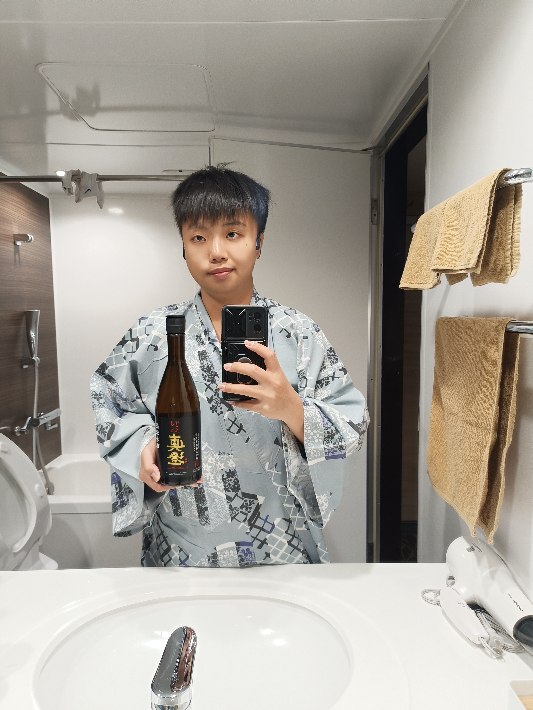
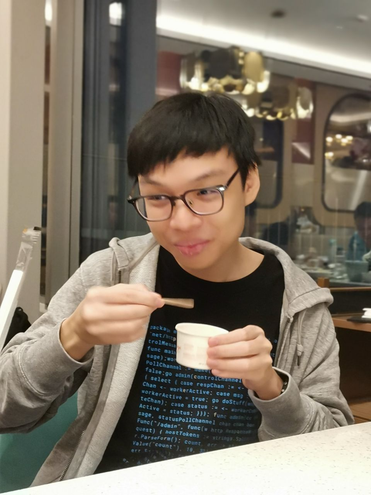
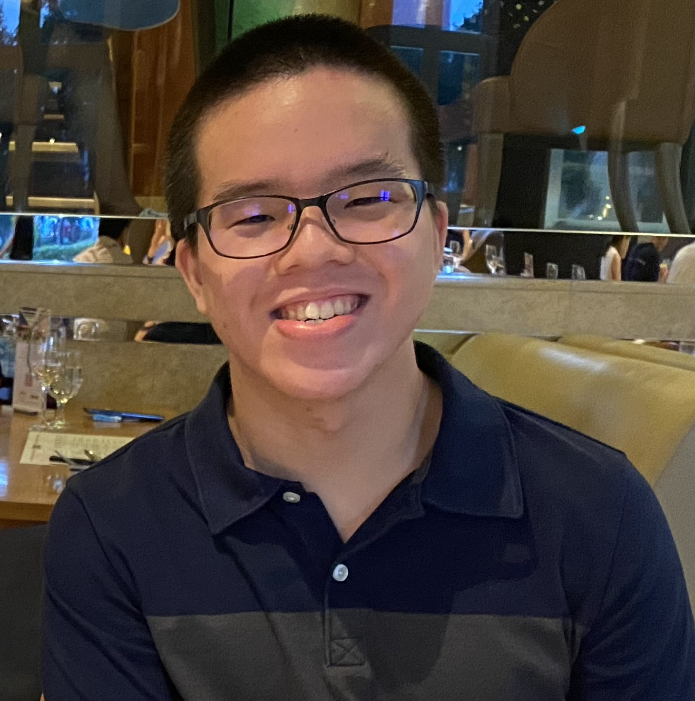

# About Us

We are a team based in the [School of Computing, National University of Singapore](http://www.comp.nus.edu.sg).

You can reach us at the email `seer[at]comp.nus.edu.sg`

## Project team

### Hibiki

[[github](http://github.com/h-b-k-nishi)]
[[portfolio](team/h-b-k-nishi.md)]

* Role: Developers
* Responsibilities: Deliverables and deadlines

### Russell

[[github](http://github.com/luna-ortus-cor)]
[[portfolio](https://www.youtube.com/watch?v=dQw4w9WgXcQ)]

* Role: Developer
* Responsibilities: Code quality

### Samuel

[[github](http://github.com/samuelneo)] [[portfolio](team/samuelneo.md)]

* Role: Developer
* Responsibilities: Documentation, deliverables and deadlines

### Yi Kai

[[github](http://github.com/kai824)]
[[portfolio](team/kai824.md)]

* Role: Developer
* Responsibilities: Code Quality

### James Doe

[[github](http://github.com/johndoe)]
[[portfolio](team/johndoe.md)]

* Role: Developer
* Responsibilities: UI
