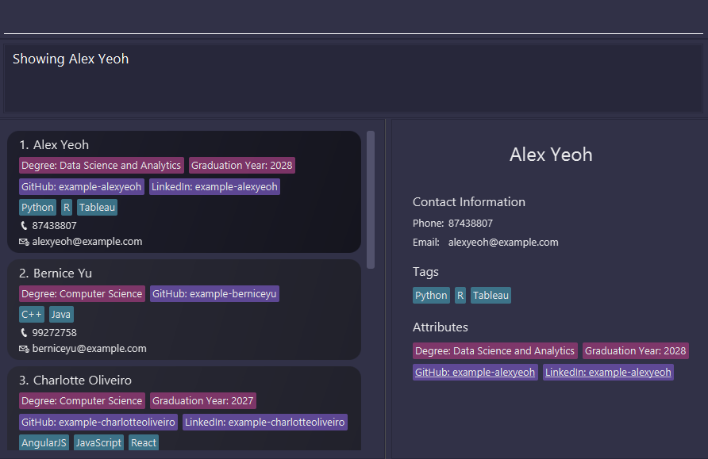

# TalentFolio User Guide

TalentFolio is a powerful yet easy-to-use application designed for hiring managers to efficiently manage information on job candidates. It is optimized for users who prefer a Command Line Interface (CLI) while still having the benefits of a Graphical User Interface (GUI). If you're a fast typist, TalentFolio can significantly speed up your hiring workflow!

<!-- * Table of Contents -->
## Table of Contents

- [Quick start](#quick-start)
  - [Install Java (if not already installed)](#install-java-if-not-already-installed)
  - [Download TalentFolio](#download-talentfolio)
  - [Set up TalentFolio](#set-up-talentfolio)
  - [Running TalentFolio](#running-talentfolio)
  - [Using TalentFolio](#using-talentfolio)
  - [Need more help?](#need-more-help)
- [Features](#features)
  - [Viewing help: `help`](#viewing-help-help)
  - [Showing a person's details: `show`](#showing-a-persons-details-show)
  - [Adding a person: `add`](#adding-a-person-add)
  - [Listing all persons: `list`](#listing-all-persons-list)
  - [Editing a person: `edit`](#editing-a-person-edit)
  - [Linking an attribute name to a site URL: `link`](#linking-an-attribute-name-to-a-website-link)
  - [Locating persons by name: `find`](#locating-persons-by-name-find)
  - [Deleting a person: `delete`](#deleting-a-person-delete)
  - [Clearing all entries: `clear`](#clearing-all-entries-clear)
  - [Filtering candidates by attributes: `filter`](#filtering-candidates-by-attributes-filter)
  - [Sorting entries by an attribute: `sort`](#sorting-entries-by-an-attribute-sort)
  - [Sorting entries by the numerical value of an attribute: `sort-num`](#sorting-entries-by-the-numerical-value-of-an-attribute-sort-num)
  - [Undoing the last data change: `undo`](#undoing-the-last-data-change-undo)
  - [Navigating past commands: <kbd>↑</kbd> <kbd>↓</kbd>](#navigating-past-commands)
  - [Exiting the program: `exit`](#exiting-the-program-exit)
  - [Saving the data](#saving-the-data)
  - [Editing the data file](#editing-the-data-file)
- [FAQ](#faq)
- [Known issues](#known-issues)
- [Command summary](#command-summary)

<page-nav-print />

--------------------------------------------------------------------------------------------------------------------

## Quick start

Follow these simple steps to get TalentFolio up and running:

1. ### Install Java (if not already installed)
   TalentFolio requires Java `17` or later to run. Check your Java version by opening a terminal or command prompt and typing: 
   `java -version` 
   If java is not installed or is an older version:
   * **Windows/Linux users:** Download and install the latest Java Development Kit (JDK) from [Oracle's website](https://www.oracle.com/java/technologies/downloads/).
   * **Mac users:** Follow the instructions and ensure you have the precise Java Development Kit (JDK) version prescribed [here](https://se-education.org/guides/tutorials/javaInstallationMac.html).

2. ### Download TalentFolio
   Get the latest version of TalentFolio from our [official release page](https://github.com/AY2425S2-CS2103T-T10-1/tp/releases). Download the latest `.jar` file available.

3. ### Set up TalentFolio
   Move the `.jar` file to the folder you want to use as the _home folder_ for TalentFolio. This folder will store the TalentFolio application data. We recommend choosing a convenient location that you have read, write and execute permissions for.

4. ### Running TalentFolio
   Open a command terminal:
   * **Windows users:** Press `Win + R`, type `cmd`, and hit Enter.
   * **Mac/Linux users** Open the Terminal app. 
   Navigate to the folder where you placed the `.jar` file. You can do this using the `cd` command. For example: 
   `cd path/to/your/folder` 
   Run the following command in the terminal to launch the application: 
   `java -jar talentfolio.jar` 
   After a few seconds, the TalentFolio application should open, and you should see a GUI similar to the one shown below. Note how the app contains some sample data. It is recommended to clear the sample data before your own personal use as the sample data will not be automatically overwritten. 
   

5. ### Using TalentFolio
   Type the command in the command box and press Enter to execute it. E.g. typing **`help`** and pressing Enter will open the help window. 
   Some example commands you can try:

   * `list` : Lists all candidates.

   * `add n/John Doe p/98765432 e/johnd@example.com` : Adds a candidate named `John Doe` to the database.

   * `edit 1 a/GPA=3.9 ra/CAP` : Adds a GPA and removes a CAP from the 1st candidate shown in the current list.

   * `filter a/Major=Computer Science` : Filters all candidates who major in Computer Science.

   * `sort a/Graduation Year` : Sorts candidates in alphabetically ascending order of Graduation Year.

   * `delete 3` : Deletes the 3rd candidate shown in the current list.

   * `clear` : Deletes all candidates.

   * `undo` : Undoes the last command.

   * `exit` : Exits the app.

6. ### Need more help?
   For a complete list of features and detailed instructions of each command, check out the [Features](#features) section below. 
   Enjoy using TalentFolio to streamline your hiring process!

--------------------------------------------------------------------------------------------------------------------

## Features

<box type="info" seamless>

**Notes about the command format:** 

* Words in `UPPER_CASE` are the parameters to be supplied by the user. 
  e.g. in `add n/NAME`, `NAME` is a parameter which can be used as `add n/John Doe`.

* Items in square brackets are optional. 
  e.g `n/NAME [t/TAG]` can be used as `n/John Doe t/Excel` or as `n/John Doe`.

* Items with `…`​ after them can be used as many times as desired–if the items are optional, 0 or more times; otherwise, 1 or more times.  
  e.g. `[t/TAG]…​` can be used as ` ` (i.e. 0 times), `t/Excel`, `t/C++ t/Java` etc.

* Parameters can be in any order. 
  e.g. if the command specifies `n/NAME p/PHONE_NUMBER`, `p/PHONE_NUMBER n/NAME` is also acceptable.

* Extraneous parameters for commands that do not take in parameters (such as `help`, `list`, `exit` and `clear`) will be ignored. 
  e.g. if the command specifies `help 123`, it will be interpreted as `help`.

* If you are using a PDF version of this document, be careful when copying and pasting commands that span multiple lines as space characters surrounding line-breaks may be omitted when copied over to the application.
</box>

### Viewing help: `help`

Shows a message explaining how to access the help page.

Format: `help`

### Showing a person's details: `show`

Shows the specified person's details in the right panel.

Format: `show INDEX`

* You can also view a person's details by clicking on them in the left panel.

Example:
* `show 1` shows the details of the 1st person. 
  

### Adding a person: `add`

Adds a person to the database.

Format: `add n/NAME p/PHONE_NUMBER e/EMAIL [t/TAG]… [a/ATTRIBUTE_NAME=ATTRIBUTE_VALUE]…`

Examples:
* `add n/John Doe p/98765432 e/johnd@example.com` Adds a person named `John Doe` with phone number `98765432` and email address `johnd@example.com`.
* `add n/Betsy Crowe t/C++ e/betsycrowe@example.com p/1234567 t/Java a/Major=Data Science and Analytics` Adds a person named `Betsy Crowe` with phone number `1234567`, email address `betsycrowe@example.com`, tags `C++` and `Java`, and an attribute named `Major` with the value `Data Science and Analytics`.

<box type="tip" seamless>

**Tip:** A person can have any number of tags and attributes (including 0).
</box>

<box type="info" seamless>

**More information on attributes:**
* Attribute names are unique. A person cannot have multiple attributes with the same name.
* Attribute names are case-aware, but case-insensitive. For example, `Major` is treated the same as `major`. The case you specify is the case that will be shown.
* Attribute values are case-sensitive.
</box>

### Listing all persons: `list`

Shows a list of all persons in the database.

Format: `list`

### Editing a person: `edit`

Edits an existing person in the database.

Format: `edit INDEX [n/NAME] [p/PHONE_NUMBER] [e/EMAIL] [t/TAG]… [a/ATTRIBUTE_NAME=ATTRIBUTE_VALUE]… [ra/NAME_OF_ATTRIBUTE_TO_REMOVE]…`

* Edits the person at the specified `INDEX`. The index refers to the index number shown in the displayed person list. The index **must be a positive integer** 1, 2, 3, …
* At least one of the optional fields must be provided.
* Existing values will be updated to the input values.

Examples:
*  `edit 1 p/91234567 e/johndoe@example.com` Edits the phone number and email address of the 1st person to be `91234567` and `johndoe@example.com` respectively.
*  `edit 2 n/Betsy Crower t/` Edits the name of the 2nd person to be `Betsy Crower` and clears all existing tags.
*  `edit 1 a/Graduation Year=2027` Adds or edits an attribute named `Graduation Year` to the 1st person.
*  `edit 1 ra/Graduation Year` Removes the attribute named `Graduation Year` from the 1st person.

<box type="info" seamless>

**For tags:**
* When editing tags, the existing tags of the person will be removed, i.e. adding of tags is not cumulative.
* You can remove all the person’s tags by typing `t/` without specifying any tags after it.
</box>

<box type="info" seamless>

**For attributes:**
* Updating an attribute requires you to specify both the attribute name and attribute value.
* If the attribute name already exists for this person, the corresponding attribute value will be updated. Otherwise, the attribute name and attribute value will be added to this person as a new attribute.
* Removing the attribute only requires you to specify the attribute name.
  * This must be an existing attribute.
  * You cannot remove an attribute that will be updated in the same command. For example, `edit 1 a/Major=Physics ra/Major` is not allowed.
</box>

### Linking an attribute name to a website: `link`

Associates an attribute name with a website URL. This means that you can visit the website by clicking on the attribute in the person's detailed view (which can be shown by clicking on them or by using the [`show`](#showing-a-persons-details-show) command).

Format (to add a link): `link a/ATTRIBUTE_NAME=SITE_LINK`

* Associates `ATTRIBUTE_NAME` with `SITE_LINK`. This change applies to all persons that have an attribute with this name. Attributes with this name that are added in the future will also be linked to this site URL.

Format (to remove an existing link): `link ra/ATTRIBUTE_NAME`

* Removes the association between `ATTRIBUTE_NAME` and the website it was associated with.

Examples:
* `link a/github=https://github.com/`
  * You can now visit `https://github.com/ATTRIBUTE_VALUE` by clicking on the attribute.
  * For example, if a person has an attribute with the name `GitHub` and the value `pochitaro2025` (usually their username), you will be directed to `https://github.com/pochitaro2025`!
* `link ra/github`
  * This will delete the association between `github` and `https://github.com/`.
  * Clicking the attribute now will have no effect.

<box type="info" seamless>

Attribute names are case-insensitive. `link a/github=https://github.com/` has the same effect as `link a/GitHub=https://github.com/`.
</box>

<box type="tip" seamless>

**Tip:** Associations for `github` and `linkedin` (`https://github.com/` and `https://www.linkedin.com/in/`) are added by default!

Enjoy the easy management of websites!
</box>

### Locating persons by name: `find`

Finds persons whose names contain any of the given keywords.

Format: `find KEYWORD…`

* You must specify at least one keyword.
* You can specify more than one keyword.
* The search is case-insensitive. For example, `hans` will match `Hans`.
* The order of the keywords does not matter. For example, `Hans Bo` will match `Bo Hans`.
* Only the name is searched.
* Words containing the keyword as a substring will be matched. For example, `Han` will match `Hans`.
  * Note that the substring must be continuous. For example, `Has` will not match `Hans`.
* Persons matching at least one keyword will be returned (i.e. `OR` search).
  For example, `Hans Bo` will match `Hans Gruber`, `Bo Yang`

Examples:
* `find John` matches any person with `John` as a substring in their name.
* `find alex david` matches any person with `alex` **OR** `david` as a substring in their name. 
  

### Deleting a person: `delete`

Deletes the specified person.

Format: `delete INDEX`

* Deletes the person at the specified `INDEX`.
* The index refers to the index number shown in the displayed person list.
* The index **must be a positive integer** 1, 2, 3, …​

Examples:
* `list` followed by `delete 2` deletes the 2nd person in the database.
* `find Betsy` followed by `delete 1` deletes the 1st person in the results of the `find` command.

### Clearing all entries: `clear`

Clears all entries.

Format: `clear`

### Filtering candidates by attributes: `filter`

Filters the candidates based on whether they have a specific attribute or not.

Format: `filter a/ATTRIBUTE_NAME=ATTRIBUTE_VALUE…`
* You must specify at least one attribute.
* You can specify more than one attribute:
  1. If you specify multiple attributes of the **SAME** name, candidates who meet **ANY** one of them will be shown.
  2. If you specify multiple attributes of **DIFFERENT** names, candidates who meet **ALL** of them will be shown.
  3. You can specify attributes of different names, with multiple values of each. In this case, the first rule will be applied first, followed by the second rule (see Examples).
  4. The order of the given attributes does not matter (see Examples).
* `ATTRIBUTE_NAME` is matched case-insensitively, while `ATTRIBUTE_VALUE` is matched case-sensitively.
* Attribute names are tolerant of typos. If no attribute with the specified attribute name is found due to a minor typo, the app corrects it.
  * For example, `GraduatOIn year` will be corrected to `GraduatIOn year` automatically, if only `Graduation year` exists as an attribute name.

Examples:
* `filter a/Major=Computer Science a/Graduation year=2028` filters all the candidates who major in Computer Science **AND** will graduate in 2028.
* `filter a/Major=Computer Science a/Major=Mathematics` filters all the candidates who major in Computer Science **OR** Mathematics.
* `filter a/Major=Computer Science a/Major=Mathematics a/Graduation year=2028` filters all the candidates who major in either Computer Science **OR** Mathematics, **AND** also graduating in 2028. That is:
  * A candidate majoring in Computer Science and graduating in 2028 will be matched.
  * A candidate majoring in Mathematics and graduating in 2028 will be matched.
  * A candidate majoring in Engineering and graduating in 2028 will **NOT** be matched, since they do not meet the first condition.
  * A candidate majoring in Computer Science and graduating in 2027 will **NOT** be matched, since they do not meet the second condition.
  * Please note that, in this case, candidates who are missing any of the attributes (i.e., do not have an attribute with the name Major or Graduation year) will **NOT** be matched. For instance, a candidate with no attributes will not be matched.
  * You can also obtain the same result with `filter a/Major=Computer Science a/Graduation year=2028 a/Major=Mathematics`, because the order of the arguments does not matter.

### Sorting entries by an attribute: `sort`

Sorts the current view of entries by the value of the specified attribute name in alphabetically ascending or descending order.

Format: `sort a/ATTRIBUTE_NAME [o/ORDER]`
* Entries without the specified attribute will be placed at the back while preserving their internal order prior to the command.
  * In the above scenario, a warning will indicate the last entry in the current view that contains the specified attribute name, if any; otherwise, it will display a warning that the specified attribute is missing.
* `ATTRIBUTE_NAME` is matched case-insensitively. For instance, a command `sort a/graduation year` can sort all entries that have an attribute with name `Graduation Year`.
* If no `ORDER` is specified, entries will be sorted in ascending order by default. Otherwise, the first character of the user input (case-insensitive) will determine the order: if it starts with 'a', entries will be sorted in ascending order; if it starts with 'd', they will be sorted in descending order.  
* Attribute names are tolerant of typos. If no attribute with the specified attribute name is found due to a minor typo, the app corrects it.
* There is no option to specify sorting in reverse order.

Example:
* `sort a/major` sorts all entries with the `Major` attribute by alphabetically ascending order of the attribute value of `Major`.
* `sort a/location` sorts all entries with the `location` attribute by alphabetically descending order of the attribute value of `Location`.

### Sorting entries by the numerical value of an attribute: `sort-num`

Sorts the current view of entries by the numeric value of the specified attribute name in ascending or descending order.

Format: `sort-num a/ATTRIBUTE_NAME [o/ORDER]`

* For each attribute value which can be parsed into a number, its numerical value will be stored.
* Entries without the specified attribute will be placed at the back while preserving their internal order prior to the command.
  * In the above scenario, a warning will indicate the last entry in the current view that has the specified attribute, if any; otherwise, it will display a warning that the specified attribute is missing.
* If there is at least one entry with the specified attribute name and some of these entries lack a valid numerical value, those entries will be placed at the back while preserving their internal order.
  * In the above scenario, a warning will indicate the last entry in the current view that contains a valid numerical value, if any; otherwise, it will display a warning that numerical values are completely missing.
* `ATTRIBUTE_NAME` is matched case-insensitively. For instance, a command `sort a/graduation year` can sort all entries that have an attribute with name `Graduation Year`.
* If no `ORDER` is specified, entries will be sorted in ascending order by default. Otherwise, the first character of the user input (case-insensitive) will determine the order: if it starts with 'a', entries will be sorted in ascending order; if it starts with 'd', they will be sorted in descending order.
* Attribute names are tolerant of typos. If no attribute with the specified attribute name is found due to a minor typo, the app corrects it.
* There is no option to specify sorting in descending order.

Example:
* `sort-num a/expected salary` sorts all entries with the `Expected Salary` attribute by ascending order of the numerical attribute value of `Expected Salary`.
* `sort-num a/GPA o/desc` sorts all entries with the `GPA` attribute by descending order of the numerical attribute value of `GPA`.

### Undoing the last data change: `undo`

Undoes the last data change. Also clears any existing filters applied.

For instance, suppose a user intended to type `delete 5` but accidentally types and executes `delete 4`. They can just type `undo` to restore the deleted entry.

Note that commands that do not change the underlying data will be skipped -- such as `filter`, `find` and `show`.

Format: `undo`
* Only changes since the app was opened can be undone.
* Changes that are undone cannot be redone. However, you can simply re-execute the command. Previous commands can be retrieved by navigating past commands using <kbd>↑</kbd> <kbd>↓</kbd> key-presses.
* `undo` can be used multiple times in succession to undo more changes.
* Clears all applied filters.
* Does not work after exiting and re-opening the app. Using `undo` on a freshly opened app will not change anything.

Examples:
* `delete 4`, then `undo` will get the result: `Last data change command undone: delete 4`
* `sort-num a/Graduation Year`, then `undo` will get the result: `Last data change command undone: sort-num a/Graduation Year`
* Assuming the app was just opened, the following actions will get the result `There is no change to undo!`. Note that existing filters will not be cleared, as the command was not successful:
  * `show 3` then `undo`
  * `find n/Alex` then `undo`
  * `filter a/Graduation Year=2025` then `undo`
* `delete 4`, then `filter a/Graduation Year=2025`, then `undo` will skip over the filtering. It will undo `delete 4` and clear the filter

### Navigating past commands: <kbd>↑</kbd> <kbd>↓</kbd>

Navigates through command history, replacing the text in the command box with the past executed command.

Format: Press the up arrow (<kbd>↑</kbd>) or down arrow (<kbd>↓</kbd>) key while the command box is selected.
* The up arrow (<kbd>↑</kbd>) key shows the previous executed command while the down arrow (<kbd>↓</kbd>) key shows the next executed command.
* `ENTER` is not required to be pressed for navigation.
* No error message will be shown if attempting to navigate beyond the first and last executed commands.
* If attempting to navigate beyond the first executed command, the first executed command will remain shown.
* If attempting to navigate beyond the last executed command, the command box will be emptied.
* Executing any valid command will reset the last executed command to the command that was just executed.
* Editing the command shown without execution will not change the previous and next executed commands.
* After editing the command shown, navigating to previous or next executed commands will discard any edits done (these edits will not be maintained when navigating back).
* Navigating past commands requires the command box to be in focus.

### Exiting the program: `exit`

Exits the program.

Format: `exit`

### Saving the data

TalentFolio data is saved in the hard disk automatically after any command that changes the data. There is no need to save manually.

### Editing the data file

TalentFolio data is saved automatically as a JSON file `[JAR file location]/data/addressbook.json`. Advanced users are welcome to update data directly by editing that data file.

<box type="warning" seamless>

**Caution:**
If your changes to the data file makes its format invalid, TalentFolio will discard all data and start with an empty data file at the next run.  Hence, it is recommended to take a backup of the file before editing it. 
Furthermore, certain edits can cause TalentFolio to behave in unexpected ways (e.g., if a value entered is outside the acceptable range). Therefore, edit the data file only if you are confident that you can update it correctly.
</box>

--------------------------------------------------------------------------------------------------------------------

## FAQ

**Q**: How do I transfer my data to another Computer? 
**A**: Install the app in the other computer and overwrite the empty data file it creates with the file that contains the data of your previous TalentFolio home folder.

--------------------------------------------------------------------------------------------------------------------

## Known issues

1. **When using multiple screens**, if you move the application to a secondary screen, and later switch to using only the primary screen, the GUI will open off-screen. The remedy is to delete the `preferences.json` file created by the application before running the application again.
2. **If you minimize the Help Window** and then run the `help` command (or use the `Help` menu, or the keyboard shortcut `F1`) again, the original Help Window will remain minimized, and no new Help Window will appear. The remedy is to manually restore the minimized Help Window.
3. **If using Linux**, clicking on links will not open them. Instead, the link will be copied to the system clipboard, and a window will appear to notify you that the link has been copied. You will have to paste the link into your browser manually.

--------------------------------------------------------------------------------------------------------------------

## Command summary

Action     | Format, Examples
-----------|----------------------------------------------------------------------------------------------------------------------------------------------------------------------
**Help**   | `help`
**Show**   | `show INDEX`   e.g., `show 1`
**Add**    | `add n/NAME p/PHONE_NUMBER e/EMAIL [t/TAG]… [a/ATTRIBUTE_NAME=ATTRIBUTE_VALUE]…`   e.g., `add n/James Ho p/22224444 e/jamesho@example.com t/C++ t/Java a/Major=Data Science and Analytics`
**List**   | `list`
**Edit**   | `edit INDEX [n/NAME] [p/PHONE_NUMBER] [e/EMAIL] [t/TAG]… [a/ATTRIBUTE_NAME=ATTRIBUTE_VALUE]… [ra/ATTRIBUTE_NAME]…`   e.g.,`edit 2 n/James Lee e/jameslee@example.com`
**Link**   | `link a/ATTRIBUTE_NAME=SITE_LINK`
**Find**   | `find KEYWORD…`  e.g., `find James Jake`
**Delete** | `delete INDEX`  e.g., `delete 3`
**Clear**  | `clear`
**Filter** | `filter a/ATTRIBUTE_NAME=ATTRIBUTE_VALUE…`   e.g., `filter a/Major=Computer Science`
**Sort** | `sort a/ATTRIBUTE_NAME [o/ORDER]`  e.g., `sort a/Degree o/ascendindg`
**Numerical Sort** | `sort-num a/ATTRIBUTE_NAME [o/ORDER]`  e.g., `sort-num a/GPA o/descending`
**Undo**   | `undo`
**Navigate Past Commands** | <kbd>↑</kbd> <kbd>↓</kbd>
**Exit**   | `exit`
