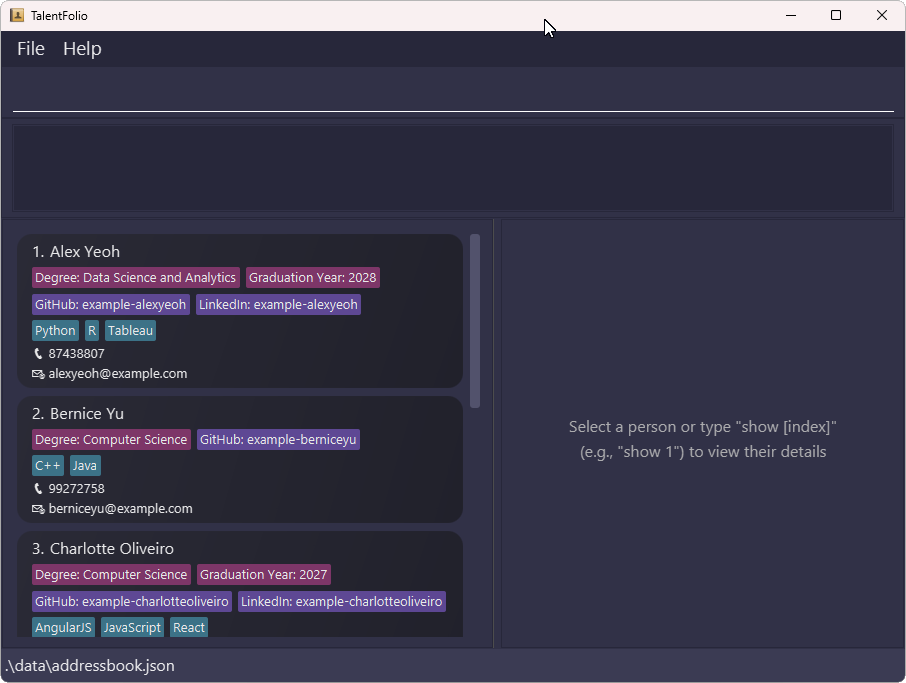

# TalentFolio User Guide

TalentFolio is an application for hiring managers to manage information on job candidates. It is optimized for users who prefer a Command Line Interface (CLI) while still having the benefits of a Graphical User Interface (GUI). If you can type fast, TalentFolio lets you handle your recruitment tasks more efficiently compared to traditional GUI applications!

<!-- * Table of Contents -->
<page-nav-print />

--------------------------------------------------------------------------------------------------------------------

## Quick start

1. Ensure you have Java `17` or above installed in your Computer. 
   **Mac users:** Ensure you have the precise JDK version prescribed [here](https://se-education.org/guides/tutorials/javaInstallationMac.html).

1. Download the latest `.jar` file from [here](https://github.com/AY2425S2-CS2103T-T10-1/tp/releases).

1. Copy the file to the folder you want to use as the _home folder_ for TalentFolio.

1. Open a command terminal, `cd` into the folder you put the jar file in, and use the `java -jar talentfolio.jar` command to run the application. 
   A GUI similar to the below should appear in a few seconds. Note how the app contains some sample data. 
   

1. Type the command in the command box and press Enter to execute it. e.g. typing **`help`** and pressing Enter will open the help window. 
   Some example commands you can try:

   * `list` : Lists all candidates.

   * `add n/John Doe p/98765432 e/johnd@example.com` : Adds a candidate named `John Doe` to the database.

   * `delete 3` : Deletes the 3rd candidate shown in the current list.

   * `clear` : Deletes all candidates.

   * `exit` : Exits the app.

1. Refer to the [Features](#features) below for details of each command.

--------------------------------------------------------------------------------------------------------------------

## Features

<box type="info" seamless>

**Notes about the command format:** 

* Words in `UPPER_CASE` are the parameters to be supplied by the user. 
  e.g. in `add n/NAME`, `NAME` is a parameter which can be used as `add n/John Doe`.

* Items in square brackets are optional. 
  e.g `n/NAME [t/TAG]` can be used as `n/John Doe t/Excel` or as `n/John Doe`.

* Items with `…`​ after them can be used multiple times including zero times. 
  e.g. `[t/TAG]…​` can be used as ` ` (i.e. 0 times), `t/Excel`, `t/C++ t/Java` etc.

* Parameters can be in any order. 
  e.g. if the command specifies `n/NAME p/PHONE_NUMBER`, `p/PHONE_NUMBER n/NAME` is also acceptable.

* Extraneous parameters for commands that do not take in parameters (such as `help`, `list`, `exit` and `clear`) will be ignored. 
  e.g. if the command specifies `help 123`, it will be interpreted as `help`.

* If you are using a PDF version of this document, be careful when copying and pasting commands that span multiple lines as space characters surrounding line-breaks may be omitted when copied over to the application.
</box>

### Viewing help : `help`

Shows a message explaning how to access the help page.

Format: `help`

### Adding a person: `add`

Adds a person to the database.

Format: `add n/NAME p/PHONE_NUMBER e/EMAIL [t/TAG]…​ [a/ATTRIBUTE=VALUE]…​`

<box type="tip" seamless>

**Tip:** A person can have any number of tags, and any number of attributes (including 0)
</box>

Examples:
* `add n/John Doe p/98765432 e/johnd@example.com`
* `add n/Betsy Crowe t/C++ e/betsycrowe@example.com p/1234567 t/Java a/Major=Data Science`

### Listing all persons: `list`

Shows a list of all persons in the database.

Format: `list`

### Editing a person: `edit`

Edits an existing person in the database.

Format: `edit INDEX [n/NAME] [p/PHONE] [e/EMAIL] [t/TAG]… [a/ATTRIBUTE_NAME=ATTRIBUTE_VALUE]… [ra/ATTRIBUTE_NAME]…​`

* Edits the person at the specified `INDEX`. The index refers to the index number shown in the displayed person list. The index **must be a positive integer** 1, 2, 3, …​
* At least one of the optional fields must be provided.
* Existing values will be updated to the input values.

For tags:
* When editing tags, the existing tags of the person will be removed i.e adding of tags is not cumulative.
* You can remove all the person’s tags by typing `t/` without specifying any tags after it.

For attributes:
* Update of attributes must specify both the attribute name and attribute value.
* Update of attributes will update an existing attribute if it exists, else it will add it as a new attribute.
* Removal of attributes only requires specifying the attribute name.
* Regardless of the order that update attribute and remove attribute parameters are provided in, all attribute updates will be processed and executed first, before attribute removal.

Examples:
*  `edit 1 p/91234567 e/johndoe@example.com` Edits the phone number and email address of the 1st person to be `91234567` and `johndoe@example.com` respectively.
*  `edit 2 n/Betsy Crower t/` Edits the name of the 2nd person to be `Betsy Crower` and clears all existing tags.
*  `edit 1 a/Graduation Year=2027` Adds or edits an attribute named "Graduation Year" to the 1st person.
*  `edit 1 ra/Graduation Year` Removes the attribute named "Graduation Year" from the 1st person.

### Locating persons by name: `find`

Finds persons whose names contain any of the given keywords.

Format: `find KEYWORD [MORE_KEYWORDS]`

* The search is case-insensitive. e.g `hans` will match `Hans`
* The order of the keywords does not matter. e.g. `Hans Bo` will match `Bo Hans`
* Only the name is searched.
* Only full words will be matched e.g. `Han` will not match `Hans`
* Persons matching at least one keyword will be returned (i.e. `OR` search).
  e.g. `Hans Bo` will return `Hans Gruber`, `Bo Yang`

Examples:
* `find John` returns `john` and `John Doe`
* `find alex david` returns `Alex Yeoh`, `David Li` 
  

### Deleting a person: `delete`

Deletes the specified person from the database.

Format: `delete INDEX`

* Deletes the person at the specified `INDEX`.
* The index refers to the index number shown in the displayed person list.
* The index **must be a positive integer** 1, 2, 3, …​

Examples:
* `list` followed by `delete 2` deletes the 2nd person in the database.
* `find Betsy` followed by `delete 1` deletes the 1st person in the results of the `find` command.

### Clearing all entries: `clear`

Clears all entries from the database.

Format: `clear`

### Filtering candidates by attributes: `filter`

Filters the candidates based on whether they have a specific attribute or not.

Format: `filter [a/ATTRIBUTE_NAME=ATTRIBUTE_VALUE]...`

* You must specify at least one attribute.
* You can specify more than one attribute:
  1. If you specify multiple attributes of the **SAME** name, candidates who meet **ANY** one of them will be shown.
  2. If you specify multiple attributes of **DIFFERENT** names, candidates who meet **ALL** of them will be shown.
  3. You can specify attributes of different names, with multiple values of each. In this case, the first rule will be applied first, followed by the second rule (see Examples).
  4. The order of the given attributes does not matter (see Examples).
* `ATTRIBUTE_NAME` is matched case-insensitively, while `ATTRIBUTE_VALUE` is matched case-sensitively.

Examples:
* `filter a/Major=Computer Science a/Graduation year=2028` filters all the candidates who major in Computer Science **AND** will graduate in 2028.
* `filter a/Major=Computer Science a/Major=Mathematics` filters all the candidates who major in Computer Science **OR** Mathematics.
* `filter a/Major=Computer Science a/Major=Mathematics a/Graduation year=2028` filters all the candidates who major in either Computer Science **OR** Mathematics, **AND** also graduating in 2028. That is:
  * A candidate majoring in Compute Science and graduating in 2028 will be matched.
  * A candidate majoring in Mathematics and graduating in 2028 will be matched.
  * A candidate majoring in Engineering and graduating in 2028 will **NOT** be matched, since they do not meet the first condition.
  * A candidate majoring in Compute Science and graduating in 2027 will **NOT** be matched, since they do not meet the second condition.
  * Please note that, in this case, candidates who are missing any of the attributes (i.e., do not have an attribute with the name Major or Graduation year) will **NOT** be matched. For instance, a candidate with no attributes will not be matched.
  * You can also obtain the same result with `filter a/Major=Computer Science a/Graduation year=2028 a/Major=Mathematics`, because the order of the arguments does not matter.

### Sorting entries by an attribute: `sort`

Sorts the current view of entries by the value of the specified attribute name in lexicographical order. 

Format: `sort a/ATTRIBUTE_NAME`

*  Entries without the specified attribute will be placed at the back while preserving their internal order prior to the command.
* `ATTRIBUTE_NAME` is matched case-insensitively. For instance, a command `sort a/graduation year` can sort all entries that have an attribute with name `Graduation Year`

Examples:
* `sort a/major` sorts all entries with the "Major" attribute by lexicographical order of the attribute value of "Major".

### Exiting the program: `exit`

Exits the program.

Format: `exit`

### Saving the data

TalentFolio data is saved in the hard disk automatically after any command that changes the data. There is no need to save manually.

### Editing the data file

TalentFolio data is saved automatically as a JSON file `[JAR file location]/data/addressbook.json`. Advanced users are welcome to update data directly by editing that data file.

<box type="warning" seamless>

**Caution:**
If your changes to the data file makes its format invalid, TalentFolio will discard all data and start with an empty data file at the next run.  Hence, it is recommended to take a backup of the file before editing it. 
Furthermore, certain edits can cause TalentFolio to behave in unexpected ways (e.g., if a value entered is outside the acceptable range). Therefore, edit the data file only if you are confident that you can update it correctly.
</box>

### Archiving data files `[coming in v2.0]`

_Details coming soon ..._

--------------------------------------------------------------------------------------------------------------------

## FAQ

**Q**: How do I transfer my data to another Computer? 
**A**: Install the app in the other computer and overwrite the empty data file it creates with the file that contains the data of your previous TalentFolio home folder.

--------------------------------------------------------------------------------------------------------------------

## Known issues

1. **When using multiple screens**, if you move the application to a secondary screen, and later switch to using only the primary screen, the GUI will open off-screen. The remedy is to delete the `preferences.json` file created by the application before running the application again.
2. **If you minimize the Help Window** and then run the `help` command (or use the `Help` menu, or the keyboard shortcut `F1`) again, the original Help Window will remain minimized, and no new Help Window will appear. The remedy is to manually restore the minimized Help Window.

--------------------------------------------------------------------------------------------------------------------

## Command summary

Action     | Format, Examples
-----------|----------------------------------------------------------------------------------------------------------------------------------------------------------------------
**Add**    | `add n/NAME p/PHONE_NUMBER e/EMAIL [t/TAG]… [a/ATTRIBUTE=VALUE]…​`   e.g., `add n/James Ho p/22224444 e/jamesho@example.com t/C++ t/Java a/Major=Data Science`
**Clear**  | `clear`
**Delete** | `delete INDEX`  e.g., `delete 3`
**Edit**   | `edit INDEX [n/NAME] [p/PHONE_NUMBER] [e/EMAIL] [t/TAG]…​`  e.g.,`edit 2 n/James Lee e/jameslee@example.com`
**Find**   | `find KEYWORD [MORE_KEYWORDS]`  e.g., `find James Jake`
**List**   | `list`
**Remove Attribute** | `remove-attribute INDEX [a/ATTRIBUTE_NAME]…​`
**Sort** | `sort a/ATTRIBUTE_NAME`  e.g., `sort a/Graduation Year`
**Help**   | `help`
